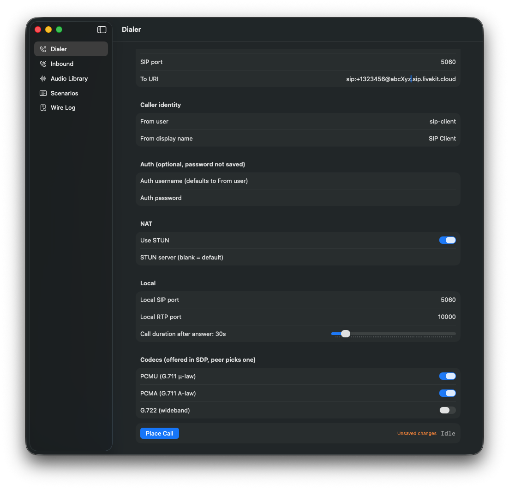
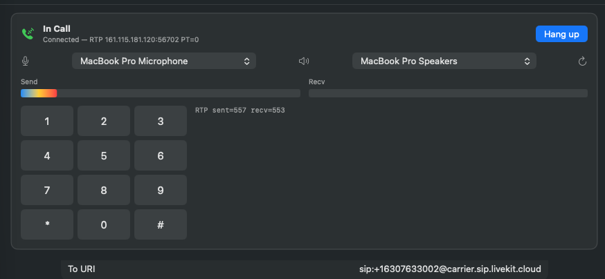

# SipClient

A small macOS SIP client built for testing SIP infrastructure. Place outbound
calls, send DTMF, run scripted scenarios, and inspect every SIP and RTP
exchange in a live wire log.





## Features

- **SIP UAC** — `INVITE` / `ACK` / `BYE` / `CANCEL`, digest auth (MD5,
  with Proxy-Authorization handling), with retransmit timers.
- **STUN** — public IP/port discovery so the SDP advertises a reachable
  RTP endpoint when behind NAT.
- **Codecs** — G.711 μ-law (PCMU), G.711 A-law (PCMA), and G.722
  (wideband). Per-profile codec selection drives the SDP offer; the peer's
  answer picks one and the client encodes/decodes in lockstep.
- **DTMF** — RFC 4733 telephone-event packets at the negotiated dynamic
  payload type.
- **Mic capture** — AudioQueueServices at the codec's native rate
  (8 kHz for G.711, 16 kHz for G.722). Live device routing via
  `kAudioQueueProperty_CurrentDevice`. Auto-refreshing device list when
  AirPods/USB devices come and go. Mute toggle on the in-call mic icon.
- **Playback** — AVAudioEngine player reconfigured per-call to match the
  negotiated codec rate.
- **Audio library** — record clips from the mic, import WAVs, and play
  them into an active call.
- **Scenarios** — scripted sequences of `waitForAnswer` / `wait` /
  `playClip` / `sendDTMF` / `hangup` that you can save and replay.
- **Wire log** — every SIP message, RTP-stat sample, audio diagnostic, and
  call event captured with timestamps; filter by kind, search by text,
  export to a `.txt` for sharing.
- **Profiles** — named SIP target configs persisted to
  `~/Library/Application Support/SipClient/profiles.json` (passwords are
  not saved).

## Build

This project is generated from `project.yml` via [XcodeGen](https://github.com/yonaskolb/XcodeGen).

```bash
brew install xcodegen     # one-time
xcodegen generate         # creates SipClient.xcodeproj
open SipClient.xcodeproj  # then run from Xcode (or use xcodebuild below)
```

Command-line build:

```bash
xcodebuild -project SipClient.xcodeproj -scheme SipClient \
  -configuration Debug -destination 'platform=macOS' build
```

The built `.app` lives under
`~/Library/Developer/Xcode/DerivedData/SipClient-*/Build/Products/Debug/SipClient.app`.

## Notes

- App sandbox is disabled in entitlements so the client can bind UDP
  ports freely (SIP 5060, RTP, STUN). This is a developer test tool, not
  a production softphone.
- Mic permission is declared in `Info.plist`
  (`NSMicrophoneUsageDescription`) and requested at first launch.
- Mic capture uses AudioQueueServices rather than AVAudioEngine's input
  node — the latter has well-known reliability issues on macOS for raw
  capture (single-buffer stalls, VPIO aggregate-device errors). Playback
  still goes through AVAudioEngine.
- There is no built-in echo canceller. For testing without howl-back, use
  headphones — the simplest fix and the standard practice for VoIP test
  harnesses on macOS.
- The G.722 implementation is a pure-Swift port of the ITU reference
  (sub-band ADPCM with a 24-tap QMF, 6-bit lower / 2-bit upper band,
  64 kbps). Note that G.722 is a bit of an RFC 3551 oddity: the audio is
  16 kHz but RTP timestamps still tick at 8 kHz.
