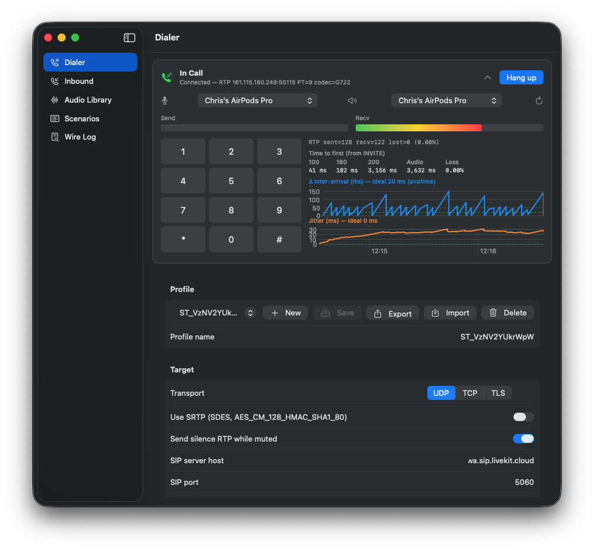
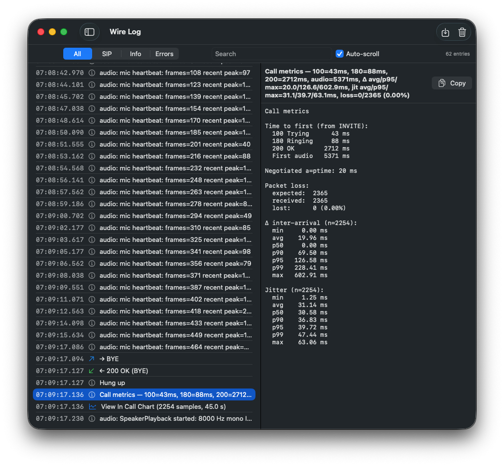
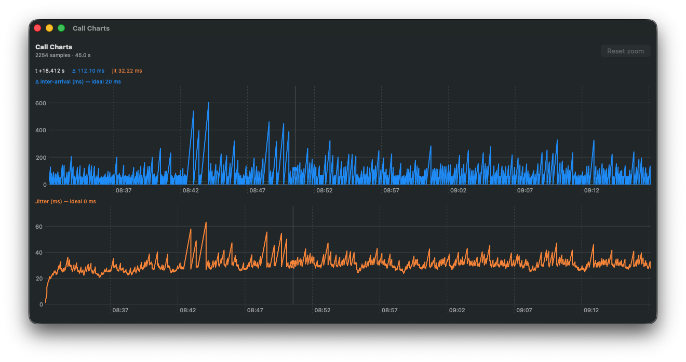

# SipClient

A small macOS SIP client built for testing SIP infrastructure. Place outbound
calls, send DTMF, run scripted scenarios, and inspect every SIP and RTP
exchange in a live wire log.

## Screens

### Live In Call Info

Easy to see some key information like how long until first `TRYING`, `RINGING`, `200 OK`, and first audio that is not silence. Also real-time Jitter and Delta chart for received RTP stream.



## Call Log

I cronological log of calls. After call the call metrics are logged.


### Call Chart

In call log can click on the Call Chart and review the metrics for the entire call.



## Features

- **SIP UAC** — `INVITE` / `ACK` / `BYE` / `CANCEL`, digest auth (MD5,
  with Proxy-Authorization handling), with retransmit timers.
- **STUN** — public IP/port discovery so the SDP advertises a reachable
  RTP endpoint when behind NAT.
- **Codecs** — G.711 μ-law (PCMU), G.711 A-law (PCMA), G.722 (wideband)
  and AMR-WB / G.722.2 (wideband). Per-profile codec selection drives the
  SDP offer; the peer's answer picks one and the client encodes/decodes in
  lockstep.
- **AMR-WB** — offered on a dynamic payload type (96) with a real 16 kHz
  RTP clock, all nine bitrate modes (6.60–23.85 kbit/s), and both RFC 4867
  payload framings. The offer states `octet-align` explicitly in either
  direction; whatever the peer answers with is what the call uses, so
  bandwidth-efficient carriers interoperate. Decoding uses the AMR-WB
  codec built into macOS (AudioToolbox); encoding uses a vendored copy of
  vo-amrwbenc, since macOS ships no AMR-WB encoder — see
  `Sources/RTP/AMRWB/vendor/VENDORED.md`.
- **DTMF** — RFC 4733 telephone-event packets at the negotiated dynamic
  payload type.
- **Mic capture** — AudioQueueServices at the codec's native rate
  (8 kHz for G.711, 16 kHz for G.722 and AMR-WB). Live device routing via
  `kAudioQueueProperty_CurrentDevice`. Auto-refreshing device list when
  AirPods/USB devices come and go. Mute toggle on the in-call mic icon.
- **Playback** — AVAudioEngine player reconfigured per-call to match the
  negotiated codec rate.
- **Audio library** — record clips from the mic, import WAVs, and play
  them into an active call.
- **Call recording** — capture a live call to a two-channel WAV: left is
  this client, right is the peer. The near channel is tapped at the RTP
  send loop, so it captures injected clips and comfort silence, not just
  what the microphone heard; the far channel is tapped at playback, so it
  is what you actually heard after jitter buffering. Both channels are
  pinned to wall-clock rather than to each other, so they cannot drift
  apart over a long call. Recording can be armed before the call connects
  and is written at the negotiated codec's rate into
  `~/Library/Application Support/SipClient/Recordings`. The wire log entry
  for a finished recording carries a **Show in Finder** button.
- **Waveform on the call charts** — when a call was recorded, the post-call
  chart window adds an audio lane above the inter-arrival and jitter
  charts, sharing their time axis and zoom, so you can line an audio
  artefact up against the jitter spike that caused it. Near end is drawn
  in the top half, far end in the bottom. The recording plays back with a
  playhead tracked across all three lanes; click any chart to move it.
  The lane switches between **Waveform** (amplitude) and **MFCC** — a
  mel-frequency cepstral heatmap, near end above and far end below, which
  distinguishes speech from comfort noise, packet-loss fill and codec
  artefacts that a waveform renders as indistinguishable wiggles.
- **Shareable HTML export** — ⌘E in the chart window writes a single
  self-contained `.html` holding the charts, the waveform and the
  recording itself (inlined as a data URI). No CDN, no sibling files and
  no network access, so it still works as an email attachment on a machine
  that has never seen this project. The exported page keeps hover
  readouts, drag-to-zoom, click-to-seek and playhead sync, and follows
  light/dark, and carries the same **Waveform / MFCC** toggle as the app —
  the heatmaps travel as PNGs, so the page shows exactly what was on
  screen without recomputing anything. Recordings over 100 MB are left out
  rather than producing an unshareable file, and the page says so.
- **Scenarios** — scripted sequences of `waitForAnswer` / `wait` /
  `playClip` / `sendDTMF` / `hangup` that you can save and replay.
- **Wire log** — every SIP message, RTP-stat sample, audio diagnostic, and
  call event captured with timestamps; filter by kind, search by text,
  export to a `.txt` for sharing.
- **Profiles** — named SIP target configs persisted to
  `~/Library/Application Support/SipClient/profiles.json` (passwords are
  not saved).

## Build

This project is generated from `project.yml` via [XcodeGen](https://github.com/yonaskolb/XcodeGen).

```bash
brew install xcodegen     # one-time
xcodegen generate         # creates SipClient.xcodeproj
open SipClient.xcodeproj  # then run from Xcode (or use xcodebuild below)
```

Command-line build:

```bash
xcodebuild -project SipClient.xcodeproj -scheme SipClient \
  -configuration Debug -destination 'platform=macOS' build
```

The built `.app` lives under
`~/Library/Developer/Xcode/DerivedData/SipClient-*/Build/Products/Debug/SipClient.app`.

## Notes

- App sandbox is disabled in entitlements so the client can bind UDP
  ports freely (SIP 5060, RTP, STUN). This is a developer test tool, not
  a production softphone.
- Mic permission is declared in `Info.plist`
  (`NSMicrophoneUsageDescription`) and requested at first launch.
- Mic capture uses AudioQueueServices rather than AVAudioEngine's input
  node — the latter has well-known reliability issues on macOS for raw
  capture (single-buffer stalls, VPIO aggregate-device errors). Playback
  still goes through AVAudioEngine.
- There is no built-in echo canceller. For testing without howl-back, use
  headphones — the simplest fix and the standard practice for VoIP test
  harnesses on macOS.
- The G.722 implementation is a pure-Swift port of the ITU reference
  (sub-band ADPCM with a 24-tap QMF, 6-bit lower / 2-bit upper band,
  64 kbps). Note that G.722 is a bit of an RFC 3551 oddity: the audio is
  16 kHz but RTP timestamps still tick at 8 kHz.
